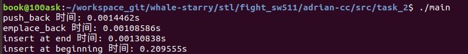

# vector学习笔记

---

## 1. vector 概述

**`vector`是一种可以存储任意类型的动态数组，属于序列式容器。**

随着元素加入，可以自动扩容。这里的自动扩容并不是在原空间之后接续新空间（因为我们无法保证原空间还有可供配置的空间），而是以原大小的两倍另外配置一块较大的空间，然后将原内容拷贝过来，然后才开始在原内容之后构造新元素，并释放原空间。因此，对`vector`的任何操作，一旦引起空间重新配置，指向`vector`的所有迭代器就失效了。

**常用函数：**

`front():`返回第一个元素

`back():`返回最后一个元素

`size():`返回`vector`元素数量的大小

`push_back():`在`vector`最后添加一个元素

`pop_back():`删除最后一个元素

`erase():`删除指定位置的元素

`insert():`在指定位置插入元素

---

## 2. 源码学习

**这里我们主要学习`vector`组成结构的实现和`vector`迭代器实现**


我们从这张图可以清晰地看出，vector继承自\_Vector_base, \_Vector_base包装了内存管理器\_Vector_impl，该内存管理器继承于allocator。

\_Vector_base专门负责vector的内存管理，内部类 \_Vector_impl 通过继承 \_Tp_alloc_type 得到内存分配释放的功能，_M_allocate和_M_deallocate分别分配和释放vector所用内存，vector只需要负责元素构造和析构。

我们首先来看\_Vector_base的源码，相应学习说明见注释

```c++
 template<typename _Tp, typename _Alloc>
    struct _Vector_base
    {
      typedef typename __gnu_cxx::__alloc_traits<_Alloc>::template
	rebind<_Tp>::other _Tp_alloc_type;    // 等价于typedef allocator<_Tp> _Tp_alloc_type
      typedef typename __gnu_cxx::__alloc_traits<_Tp_alloc_type>::pointer
       	pointer;

      struct _Vector_impl_data
      {
	pointer _M_start;     // 使用空间起始位置
	pointer _M_finish;    // 使用空间结束位置
	pointer _M_end_of_storage;    // 可用空间结束位置

	_Vector_impl_data() _GLIBCXX_NOEXCEPT
	: _M_start(), _M_finish(), _M_end_of_storage()   //impl 构造函数
	{ }

#if __cplusplus >= 201103L
	_Vector_impl_data(_Vector_impl_data&& __x) noexcept
	: _M_start(__x._M_start), _M_finish(__x._M_finish),
	  _M_end_of_storage(__x._M_end_of_storage)
	{ __x._M_start = __x._M_finish = __x._M_end_of_storage = pointer(); }
#endif

	void
	_M_copy_data(_Vector_impl_data const& __x) _GLIBCXX_NOEXCEPT
	{
	  _M_start = __x._M_start;
	  _M_finish = __x._M_finish;
	  _M_end_of_storage = __x._M_end_of_storage;
	}

	void
	_M_swap_data(_Vector_impl_data& __x) _GLIBCXX_NOEXCEPT
	{
	  // Do not use std::swap(_M_start, __x._M_start), etc as it loses
	  // information used by TBAA.
	  _Vector_impl_data __tmp;
	  __tmp._M_copy_data(*this);
	  _M_copy_data(__x);
	  __x._M_copy_data(__tmp);
	}
      };

      struct _Vector_impl  // 内存管理器
	: public _Tp_alloc_type, public _Vector_impl_data
      {
	_Vector_impl() _GLIBCXX_NOEXCEPT_IF(
	    is_nothrow_default_constructible<_Tp_alloc_type>::value)
	: _Tp_alloc_type()
	{ }

	_Vector_impl(_Tp_alloc_type const& __a) _GLIBCXX_NOEXCEPT
	: _Tp_alloc_type(__a)
	{ }

#if __cplusplus >= 201103L
	// Not defaulted, to enforce noexcept(true) even when
	// !is_nothrow_move_constructible<_Tp_alloc_type>.
	_Vector_impl(_Vector_impl&& __x) noexcept
	: _Tp_alloc_type(std::move(__x)), _Vector_impl_data(std::move(__x))
	{ }

	_Vector_impl(_Tp_alloc_type&& __a) noexcept
	: _Tp_alloc_type(std::move(__a))
	{ }

	_Vector_impl(_Tp_alloc_type&& __a, _Vector_impl&& __rv) noexcept
	: _Tp_alloc_type(std::move(__a)), _Vector_impl_data(std::move(__rv))
	{ }
#endif


    public:
      typedef _Alloc allocator_type;

      _Tp_alloc_type&
      _M_get_Tp_allocator() _GLIBCXX_NOEXCEPT
      { return this->_M_impl; }

      const _Tp_alloc_type&
      _M_get_Tp_allocator() const _GLIBCXX_NOEXCEPT
      { return this->_M_impl; }

      allocator_type
      get_allocator() const _GLIBCXX_NOEXCEPT
      { return allocator_type(_M_get_Tp_allocator()); }

#if __cplusplus >= 201103L
      _Vector_base() = default;
#else
      _Vector_base() { }
#endif

      _Vector_base(const allocator_type& __a) _GLIBCXX_NOEXCEPT
      : _M_impl(__a) { }

      // Kept for ABI compatibility.
#if !_GLIBCXX_INLINE_VERSION
      _Vector_base(size_t __n)
      : _M_impl()
      { _M_create_storage(__n); }
#endif

      _Vector_base(size_t __n, const allocator_type& __a)
      : _M_impl(__a)
      { _M_create_storage(__n); }

#if __cplusplus >= 201103L
      _Vector_base(_Vector_base&&) = default;

      // Kept for ABI compatibility.
# if !_GLIBCXX_INLINE_VERSION
      _Vector_base(_Tp_alloc_type&& __a) noexcept
      : _M_impl(std::move(__a)) { }

      _Vector_base(_Vector_base&& __x, const allocator_type& __a)
      : _M_impl(__a)
      {
	if (__x.get_allocator() == __a)
	  this->_M_impl._M_swap_data(__x._M_impl);
	else
	  {
	    size_t __n = __x._M_impl._M_finish - __x._M_impl._M_start;
	    _M_create_storage(__n);
	  }
      }
# endif

      _Vector_base(const allocator_type& __a, _Vector_base&& __x)
      : _M_impl(_Tp_alloc_type(__a), std::move(__x._M_impl))
      { }
#endif

      ~_Vector_base() _GLIBCXX_NOEXCEPT
      {
        
        
	_M_deallocate(_M_impl._M_start,
		      _M_impl._M_end_of_storage - _M_impl._M_start);
      }

    public:
      _Vector_impl _M_impl;

      // 通过 _M_impl申请内存 
      pointer
      _M_allocate(size_t __n)
      {
	typedef __gnu_cxx::__alloc_traits<_Tp_alloc_type> _Tr;
	return __n != 0 ? _Tr::allocate(_M_impl, __n) : pointer();
      }
			 // 通过 _M_impl释放内存,返回void
      void
      _M_deallocate(pointer __p, size_t __n)
      {
	typedef __gnu_cxx::__alloc_traits<_Tp_alloc_type> _Tr;
	if (__p)
	  _Tr::deallocate(_M_impl, __p, __n);
      }

    protected:
      void
      _M_create_storage(size_t __n)
      {
	this->_M_impl._M_start = this->_M_allocate(__n);
	this->_M_impl._M_finish = this->_M_impl._M_start;
	this->_M_impl._M_end_of_storage = this->_M_impl._M_start + __n;
      }
    };

```

小结：`_Vector_base`专门负责`vector`的内存管理，内部类`_M_impl`通过继承`_Tp_alloc_type`(也就是allocator)得到内存分配释放的功能，\_M_allocate和_M_deallocate分别分配和释放vector所用内存，vector只需要负责元素构造和析构。

vector源码如下：

```c++
 template<typename _Tp, typename _Alloc = std::allocator<_Tp> >
    class vector : protected _Vector_base<_Tp, _Alloc>
    {}
```

这里我们可以看出默认内存分配器为`std::allocator<_Tp>`

`vector`迭代器代码：

```c++
typedef __gnu_cxx::__normal_iterator <pointer, vector> iterator;
typedef __gnu_cxx::__normal_iterator <const_pointer, vector> const_iterator;
```

这里可以看出vector使用的是__normal_iterator迭代器

```c++
template<typename _Iterator, typename _Container> 
    class __normal_iterator 
    { 
    protected: 
      _Iterator _M_current;   // _M_current是指向迭代器位置的指针，这是一个随机访问型指针
      typedef iterator_traits<_Iterator>                __traits_type; 
    public: 
      // iterator必须包含的五种typedef
      typedef typename __traits_type::iterator_category iterator_category;
      typedef typename __traits_type::value_type      value_type;
      typedef typename __traits_type::difference_type     difference_type;
      typedef typename __traits_type::reference   reference;
      typedef typename __traits_type::pointer     pointer;
  
      _GLIBCXX_CONSTEXPR __normal_iterator() : _M_current(_Iterator()) { } 
      explicit 
      __normal_iterator(const _Iterator& __i) : _M_current(__i) { } 
//拷贝构造函数
      template<typename _Iter> 
        __normal_iterator(const __normal_iterator<_Iter, 
                          typename __enable_if< 
               (std::__are_same<_Iter, typename _Container::pointer>::__value), 
                      _Container>::__type>& __i) 
        : _M_current(__i.base()) { } 
      reference 
      operator*() const 
      { return *_M_current; } 
      pointer 
      operator->() const 
      { return _M_current; } 
 __normal_iterator& 
   		// 前++
      operator++() 
      { 
        ++_M_current; 
        return *this; 
      } 
      __normal_iterator 
       // 后++
      operator++(int) 
      { return __normal_iterator(_M_current++); } 
      __normal_iterator& 
      operator--() 
      { 
        --_M_current; 
        return *this; 
      } 
      __normal_iterator 
      operator--(int) 
      { return __normal_iterator(_M_current--); } 
      reference 
        
       // vector是连续空间，它的迭代器是随机访问迭代器，故要重载操作符[]
      operator[](const difference_type& __n) const 
      { return _M_current[__n]; } 

      __normal_iterator& 
      operator+=(const difference_type& __n) 
      { _M_current += __n; return *this; } 
      __normal_iterator 
      operator+(const difference_type& __n) const 
      { return __normal_iterator(_M_current + __n); } 
 __normal_iterator& 
      operator-=(const difference_type& __n) 
      { _M_current -= __n; return *this; } 
      __normal_iterator 
      operator-(const difference_type& __n) const 
      { return __normal_iterator(_M_current - __n); } 
      const _Iterator& 
      base() const 
      { return _M_current; } 
    };
```


---

## 3. 测试说明

在日常使用中我们都是随意使用insert函数和push_back函数，以及emplace_back（）函数，那么我们是否可以测试这三种函数的性能。以便于我们以后使用中选择性能更好的一种方式呢。

所以我们对上面三种函数的性能进行了测试，测试代码见src/task_2/main.cpp



从测试结果我们可以看出，同时在尾部插入，emplace_back性能由于push_back优于insert。并且我们注意到在vector头部使用insert的效率极差，在日常使用vector中我们一定要避免这类方式。

---